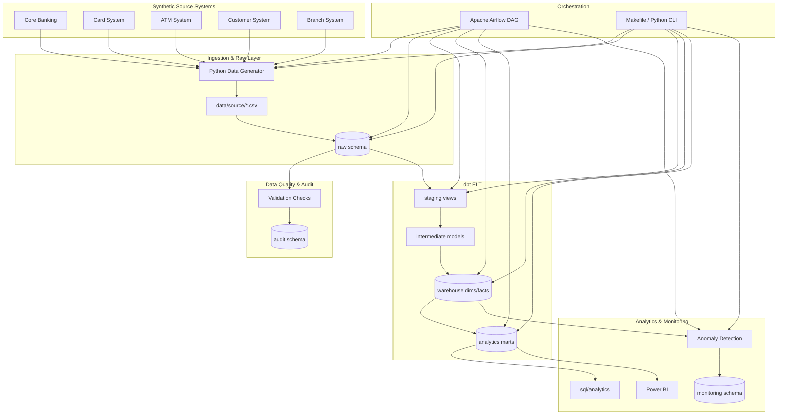

# NovaBank Banking Transaction Analytics Pipeline

> **Safety notice:** This project uses synthetic banking data generated solely for demonstrating data engineering, analytics, and transaction-monitoring capabilities. It does not represent real customer or banking data.

**Live demo:** [Vercel site](https://banking-transaction-analytics.vercel.app) · [BI Dashboard](https://banking-transaction-analytics.vercel.app/dashboard) · [GitHub](https://github.com/alirazach476/banking-transaction-analytics)

> URLs finalize after first deploy — if the Vercel subdomain differs, use the link printed by `vercel --prod`.

End-to-end portfolio project for **NovaBank**, a fictional retail bank. The platform ingests multi-source synthetic banking feeds, validates data quality, loads a PostgreSQL warehouse via **dbt**, runs **transaction anomaly detection**, and exposes analytics marts for **Power BI** and advanced SQL.

---

## Overview

NovaBank management needs a single source of truth for:

- Transaction volume and value across channels (ATM, Branch, Mobile App, Internet Banking, POS, Online)
- Customer and account activity segmentation
- Branch and regional performance
- Payment mix (deposits, withdrawals, transfers, card payments)
- Transaction failures and operational health
- **Transaction Anomaly Detection Prototype** (analytical demo — not production fraud)

The pipeline demonstrates skills expected of Data Engineers, Analytics Engineers, Data Analysts, and BI developers: ingestion, dimensional modeling (star schema + SCD2), orchestration, reconciliation, testing, and BI specification.

---

## Architecture



See [docs/architecture.md](docs/architecture.md) for layered diagrams and design rationale.

---

## Tech Stack

| Layer | Technology |
|-------|------------|
| Language | Python 3.11+ |
| Database | PostgreSQL 16 |
| Transform | dbt Core |
| Orchestration | Apache Airflow 2.8 |
| ML (prototype) | scikit-learn (Isolation Forest) |
| BI | Power BI (documented specs) |
| Infra | Docker Compose |
| Testing | pytest |

---

## Quick Start (Windows)

### Prerequisites

- Python 3.11+
- [Docker Desktop](https://www.docker.com/products/docker-desktop/) (recommended), **or** embedded PostgreSQL fallback
- Git (optional)

### 1. Clone and configure

```powershell
cd "c:\Users\DELL\Downloads\Bank Anaylsis"
copy .env.example .env
python -m pip install -r requirements.txt
```

### 2. Start PostgreSQL

**Option A — Docker (recommended):**

```powershell
docker compose up -d postgres
# Wait ~10 seconds for health check
```

**Option B — Embedded PostgreSQL (no Docker):**

```powershell
python scripts/start_embedded_postgres.py
```

This starts a local Postgres under `.pgdata/` and **updates `.env`** with the assigned host/port. Embedded instances often use a **non-5432 port** — always check `.env` after starting.

### 3. Bootstrap schemas (if not using Docker init scripts)

```powershell
python scripts/bootstrap_db.py
```

### 4. Run the full pipeline

```powershell
python -m src.pipeline.run_pipeline
```

Or with Make (if installed):

```powershell
make pipeline
```

### 5. Optional — Airflow

```powershell
docker compose up -d
# UI: http://localhost:8080  (admin / admin)
# Enable DAG: banking_daily_pipeline
```

---

## Makefile & Python Commands

| Target | Python equivalent | Description |
|--------|-------------------|-------------|
| `make setup` | `pip install -r requirements.txt` | Install dependencies, copy `.env` |
| `make docker-up` | `docker compose up -d postgres` | Start Postgres |
| `make generate-data` | `python -m src.data_generation.generate_all` | Demo volumes |
| `make generate-data-full` | See Makefile env overrides | Full portfolio scale |
| `make ingest` | `python -m src.ingestion.load_raw` | Load CSV → raw |
| `make validate` | `python -m src.validation.run_validation` | DQ checks |
| `make dbt-build` | `cd dbt && dbt build --profiles-dir .` | Transform warehouse |
| `make anomaly-detection` | `python -m src.anomaly_detection.run_detection` | Run detection |
| `make reconcile` | `python -m src.validation.reconciliation` | Source vs warehouse |
| `make insights` | `python -m src.utils.generate_insights` | Business insights MD |
| `make test` | `pytest tests/ -v` | Unit tests |
| `make pipeline` | `python -m src.pipeline.run_pipeline` | End-to-end |
| `make clean` | — | Remove generated artifacts |

**Pipeline flags:**

```powershell
python -m src.pipeline.run_pipeline --skip-generate   # reuse existing CSVs
python -m src.pipeline.run_pipeline --skip-dbt        # skip dbt build
python -m src.pipeline.run_pipeline --mode incremental
```

---

## Demo vs Full Volumes

Configured via `.env` (see `.env.example`):

| Entity | Demo (default) | Full portfolio |
|--------|----------------|----------------|
| Customers | 5,000 | 100,000 |
| Accounts | 7,500 | 150,000 |
| Transactions | 100,000 | 2,000,000+ |
| Branches | 50 | 500 |
| Merchants | 1,000 | 20,000 |
| Cards | 10,000 | 200,000 |
| Transfers | 15,000 | 300,000+ |
| ATM txns | 20,000 | 400,000+ |
| Card txns | 40,000 | 800,000+ |

Demo volumes run in minutes on a laptop. Full volumes require more RAM and disk; use `make generate-data-full` or set env vars before generation.

---

## End-to-End Pipeline Flow

```text
1. Generate synthetic CSVs     → data/source/**
2. Apply DDL                   → sql/ddl/*
3. Ingest to raw               → raw.*
4. Validate data quality       → audit.data_quality_results
5. dbt build                   → staging → warehouse → analytics
6. Anomaly detection           → monitoring.transaction_anomalies
7. Reconciliation              → audit.reconciliation_results
8. Business insights           → analysis/business_insights.md
```

Airflow DAG `banking_daily_pipeline` mirrors this graph for scheduled runs.

---

## Project Structure

```text
├── README.md, LICENSE, Makefile, docker-compose.yml, Dockerfile
├── config/                 # Settings, anomaly config
├── data/
│   ├── source/             # Generated CSVs by source system
│   ├── raw/, processed/
├── src/
│   ├── data_generation/    # Synthetic data + anomalies
│   ├── ingestion/          # Raw load (idempotent)
│   ├── validation/         # DQ + reconciliation
│   ├── anomaly_detection/  # Rules, z-score, Isolation Forest
│   ├── pipeline/           # Orchestration entry point
│   └── utils/
├── sql/
│   ├── ddl/
│   ├── analytics/          # Portfolio SQL queries
│   ├── reconciliation/
│   └── performance/
├── dbt/                    # Staging, warehouse, analytics marts
├── airflow/dags/           # banking_daily_pipeline.py
├── dashboards/powerbi/     # PBI specs, DAX, data model
├── analysis/               # Insights and anomaly evaluation
├── docs/                   # Architecture, metrics, interview guide
├── scripts/                # bootstrap_db, embedded postgres
└── tests/
```

---

## Power BI

Connection and dashboard build instructions: [dashboards/powerbi/README.md](dashboards/powerbi/README.md).

Connect to `analytics` schema marts (e.g. `mart_daily_transactions`, `mart_customer_activity`, `mart_anomaly_monitoring`).

---

## Documentation Index

| Document | Purpose |
|----------|---------|
| [docs/architecture.md](docs/architecture.md) | System design |
| [docs/data_model.md](docs/data_model.md) | Star schema, grain, SCD2 |
| [docs/data_dictionary.md](docs/data_dictionary.md) | Tables and columns |
| [docs/metrics.md](docs/metrics.md) | KPI definitions |
| [docs/pipeline.md](docs/pipeline.md) | Ingestion, incremental, watermarks |
| [docs/data_quality.md](docs/data_quality.md) | DQ rules |
| [docs/reconciliation.md](docs/reconciliation.md) | Source vs warehouse |
| [docs/anomaly_detection.md](docs/anomaly_detection.md) | Detection methods |
| [docs/performance.md](docs/performance.md) | Indexes, EXPLAIN |
| [docs/interview_guide.md](docs/interview_guide.md) | 26 Q&A |
| [docs/cloud_architecture.md](docs/cloud_architecture.md) | AWS/Azure/GCP paths |
| [docs/final_report.md](docs/final_report.md) | Project report |

---

## Safety & Compliance

- **No real PII, PANs, or account numbers** — card IDs are tokenized (`CARD-000001`).
- Anomaly output is labeled **"potential anomaly"** / **"transaction requiring review"**.
- Do not deploy this prototype as a fraud decision engine.
- Never commit `.env` or credentials.

---

## License

MIT License — see [LICENSE](LICENSE). Copyright 2026 NovaBank Analytics Portfolio.
