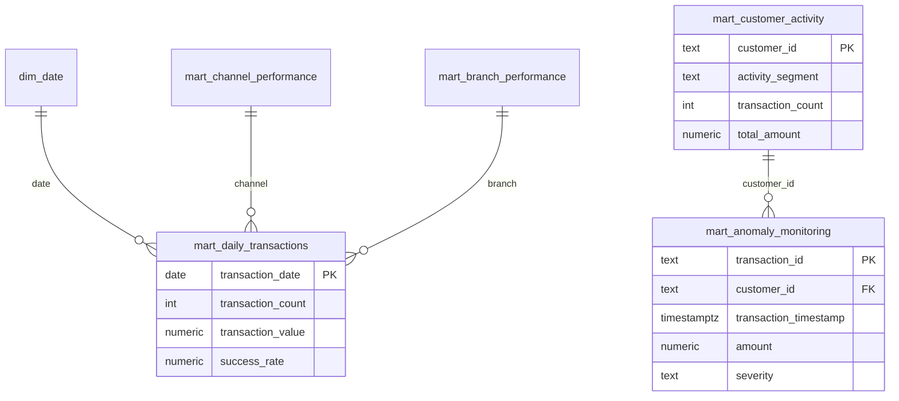

# Power BI Data Model — NovaBank

> **Disclaimer:** This project uses synthetic banking data generated solely for demonstrating data engineering, analytics, and transaction-monitoring capabilities. It does not represent real customer or banking data.

## Modeling Strategy

Import pre-aggregated **analytics marts** as the primary data source. This mirrors the warehouse star schema without requiring analysts to join ten tables in Power BI.

For advanced users, optional import of `warehouse` dimensions enables role-playing and drill-through.

---

## Recommended Import Mode

| Mode | When |
|------|------|
| **Import** | Demo volumes (≤100k transactions) — fast visuals |
| **DirectQuery** | Full portfolio scale — always filter by date |

---

## Star Schema (Logical)



---

## Table Roles

| Table | Role | Cardinality notes |
|-------|------|-------------------|
| mart_daily_transactions | Fact (aggregated) | One row per day |
| mart_monthly_transactions | Fact (aggregated) | One row per month |
| mart_customer_activity | Dimension + measures | One row per customer |
| mart_account_activity | Dimension + measures | One row per account |
| mart_channel_performance | Fact (by channel) | One row per channel |
| mart_branch_performance | Fact (by branch) | One row per branch |
| mart_payment_activity | Fact (by payment type) | One row per type |
| mart_anomaly_monitoring | Fact (transaction grain) | One row per flagged txn |
| mart_transaction_failures | Fact (failures) | Subset of transactions |
| dim_date (optional) | Date dimension | date_key or calendar_date |

---

## Relationships

Configure in **Model view** — single direction filter from dimension → fact.

### Primary relationships

| From | To | Column | Cardinality | Cross-filter |
|------|-----|--------|-------------|--------------|
| dim_date[calendar_date] | mart_daily_transactions[transaction_date] | date | 1:* | Single |
| mart_customer_activity[customer_id] | mart_anomaly_monitoring[customer_id] | customer | 1:* | Single |
| mart_customer_activity[customer_id] | mart_account_activity[customer_id] | customer | 1:* | Both* |

*Use both only if needed; may cause ambiguity — prefer separate customer dimension table.

### Recommended: conformed customer dimension

Create calculated table or import `warehouse.dim_customer` (is_current = true):

```text
dim_customer[customer_id] 1 → * mart_anomaly_monitoring[customer_id]
dim_customer[customer_id] 1 → * mart_customer_activity[customer_id]
```

Hide duplicate name columns from fact tables.

### Date table

Mark `dim_date` or `mart_daily_transactions[transaction_date]` as **Date Table** for time intelligence.

If using mart date only:

- Create `Calendar = CALENDAR(MIN(date), MAX(date))`
- Mark as date table

---

## Hidden Columns

Hide from report view:

- Surrogate keys (customer_key, account_key)
- refreshed_at timestamps
- Internal audit IDs unless Page 7

---

## No Many-to-Many

Avoid many-to-many between marts. If branch and channel marts both connect to daily mart, use:

- Separate pages, or
- A unified fact table at transaction grain (mart_anomaly_monitoring without anomaly filter)

---

## Row-Level Security (Future)

Demo optional RLS by region:

```dax
[region] = USERPRINCIPALNAME()  -- example pattern
```

Not implemented in portfolio — document as enterprise extension.

---

## Measure Placement

All measures in `_Metrics` blank table — no relationships required.

---

## Audit Schema (Page 7)

Import separately; weak or no relationships to business marts:

| Table | Link |
|-------|------|
| audit_pipeline_runs | Standalone |
| audit_data_quality_results | Standalone |
| audit_reconciliation_results | Standalone |

Use measures with `MAX()` / `TOPN()` for latest run — avoid relationship to facts.

---

## Naming Conventions

- Tables: PascalCase matching PostgreSQL mart names (Power BI may replace dots with underscores)
- Columns: snake_case as imported
- Measures: Title Case in Display folders

---

## Validation Checklist

- [ ] Date column marked as date type (not datetime text)
- [ ] No auto-detected incorrect relationships (disable autodetect if needed)
- [ ] Numeric columns are Decimal Number, not Text
- [ ] `activity_segment` sorted by custom order column (Inactive=1 … Premium=5)
- [ ] `severity` sorted Critical > High > Medium > Low

See [README.md](README.md) for connection steps and [dax_measures.md](dax_measures.md) for measures.
