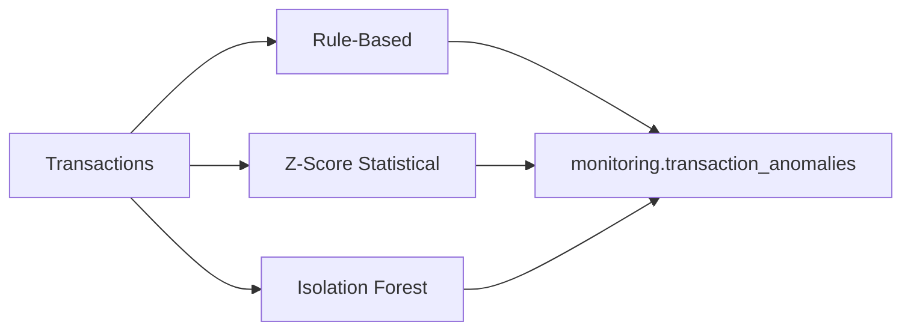

# Transaction Anomaly Detection Prototype

> **Disclaimer:** This project uses synthetic banking data generated solely for demonstrating data engineering, analytics, and transaction-monitoring capabilities. It does not represent real customer or banking data.

## Important Terminology

This system is a **Transaction Anomaly Detection Prototype** — an analytical demonstration for portfolio and interview purposes.

- Use **"potential anomaly"** or **"transaction requiring review"**
- Do **NOT** label outputs as confirmed fraud
- Do **NOT** deploy as a production fraud decision engine

Real fraud systems require labeled datasets, regulatory compliance, model governance, and real-time scoring infrastructure not present here.

---

## Overview

Three complementary detection methods score each transaction:



Results merge into `monitoring.transaction_anomalies` with combined `anomaly_reason`, scores, and `severity`.

---

## Method 1: Rule-Based Detection

**Module:** `src/anomaly_detection/rule_based.py`

| Rule | Logic |
|------|-------|
| **High amount** | `abs(z_score) >= threshold` OR `amount > customer_avg * ANOMALY_HIGH_AMOUNT_MULTIPLIER` |
| **High frequency** | `transactions_last_24_hours >= config threshold` |
| **Rapid transactions** | Count in `ANOMALY_RAPID_WINDOW_MINUTES` >= `ANOMALY_RAPID_COUNT_THRESHOLD` |
| **Night activity** | Hour 0–5 and amount >= night minimum |
| **Multiple failures** | Recent failed txns followed by high-value success |
| **Sudden behavior change** | Amount >> recent rolling average |

Configuration: `config/anomaly_config.yaml` and `.env` (`ANOMALY_*` variables).

Output: `rule_based_score` (0–1), list of reasons, severity mapping.

---

## Method 2: Statistical (Z-Score)

**Module:** `src/anomaly_detection/statistical.py`

Per-customer baseline:

```text
z_score = (transaction_amount - customer_mean) / customer_std
```

Flag when:

```text
abs(z_score) >= ANOMALY_ZSCORE_THRESHOLD  (default 3.0)
```

Features also computed in dbt `int_anomaly_features`:

- `customer_avg_transaction`
- `customer_std_transaction`
- `amount_vs_customer_avg`
- `amount_percentile`
- `transactions_last_10_min`, `_1_hour`, `_24_hours`

Uses SQL window functions where possible; Python for detection persistence.

---

## Method 3: Isolation Forest (ML)

**Module:** `src/anomaly_detection/ml_isolation_forest.py`

**Algorithm:** scikit-learn `IsolationForest`

**Features:**

- transaction_amount
- hour_of_day
- transactions_last_1_hour
- amount_vs_customer_avg
- transaction_frequency proxy

**Output:**

- `ml_anomaly_score` — decision function (lower = more anomalous)
- `ml_anomaly_flag` — binary flag based on contamination parameter

**Config:** `ISOLATION_FOREST_CONTAMINATION=0.02` (expected anomaly proportion)

### Why Isolation Forest?

- Unsupervised — no labeled fraud dataset required
- Handles multivariate patterns (amount + frequency + time)
- Fast training on demo volumes
- Common interview talking point for anomaly detection

**Limitation:** Contamination parameter assumes known anomaly rate; real fraud is far rarer and non-stationary.

---

## Severity Mapping

| Severity | Typical triggers |
|----------|------------------|
| Low | Single weak rule hit |
| Medium | Multiple rules or moderate z-score |
| High | High amount + rapid transactions |
| Critical | Extreme amount, multiple methods agree |

---

## Anomaly Reasons (Examples)

- Unusually High Amount
- Unusually High Frequency
- Rapid Transactions
- Unusual Transaction Time
- Sudden Behavior Change
- Multiple Failed Transactions
- ML Detected Anomaly

Multiple reasons pipe-delimited: `Unusually High Amount|ML Detected Anomaly`

---

## Injected Anomalies (Ground Truth for Demo)

The data generator marks synthetic anomalies:

- `raw.transactions.is_injected_anomaly = true`
- `raw.transactions.anomaly_type` — high_amount, high_frequency, etc.

Injection rate: `ANOMALY_INJECTION_RATE=0.02` (2%)

Evaluation approach: see [analysis/anomaly_analysis.md](../analysis/anomaly_analysis.md). Do not claim precision/recall without acknowledging synthetic labels.

---

## dbt Integration

- `int_anomaly_features` — SQL feature engineering
- `mart_anomaly_monitoring` — BI-ready join of facts + anomaly flags

---

## Monitoring Table

`monitoring.transaction_anomalies` — see [data_dictionary.md](data_dictionary.md).

Query example:

```sql
SELECT severity, COUNT(*) AS cnt
FROM monitoring.transaction_anomalies
GROUP BY severity
ORDER BY cnt DESC;
```

---

## Operational Notes

- Batch scoring after daily dbt build (not real-time)
- Re-run safe: upserts by transaction_id
- Power BI Page 6 dedicated to anomaly monitoring

See [interview_guide.md](interview_guide.md) questions 22–26 for interview narratives.
