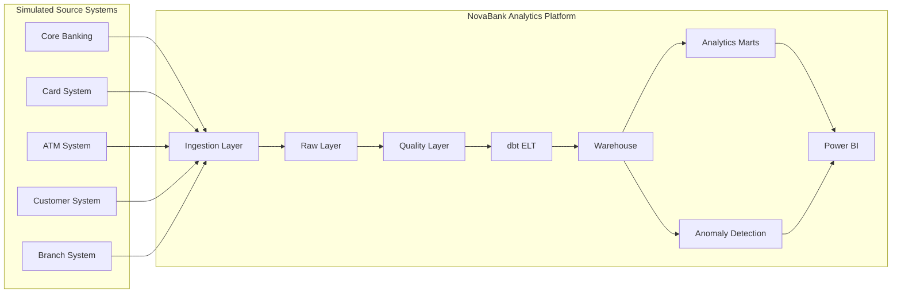
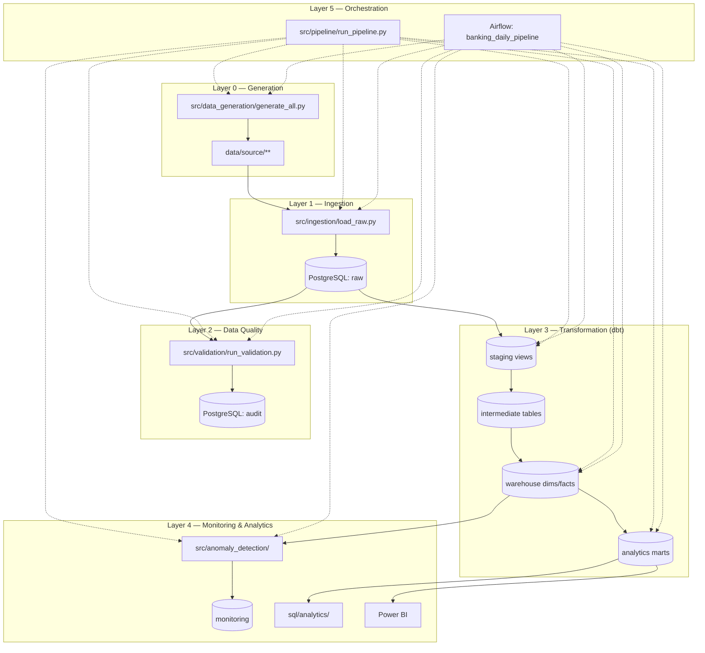
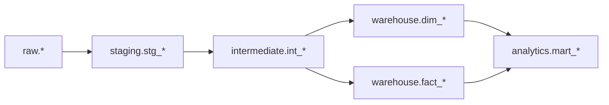
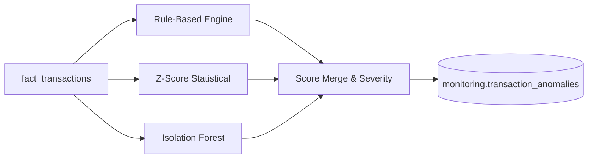
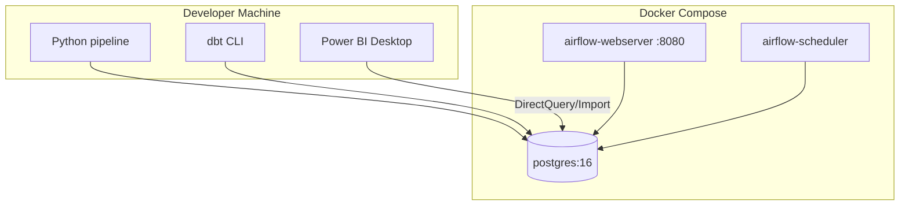

# NovaBank Architecture

> **Disclaimer:** This project uses synthetic banking data generated solely for demonstrating data engineering, analytics, and transaction-monitoring capabilities. It does not represent real customer or banking data.

## System Context

NovaBank operates multiple legacy-style source systems that export CSV extracts. The analytics platform consolidates these into PostgreSQL, transforms them with dbt into a dimensional warehouse, and serves BI and monitoring use cases.

---

## Layered Pipeline

---

## PostgreSQL Schema Layout

| Schema | Role |
|--------|------|
| `raw` | As-ingested TEXT columns; preserves source quirks |
| `staging` | dbt views: typed, cleaned, deduplicated |
| `intermediate` | Business logic, enrichments, feature engineering |
| `warehouse` | Star schema dimensions and facts |
| `analytics` | Business-facing marts (denormalized for BI) |
| `audit` | Pipeline runs, DQ results, watermarks, reconciliation |
| `monitoring` | Transaction anomaly results |

DDL: `sql/ddl/01_create_schemas.sql` through `05_create_airflow_db.sql`.

---

## Source System Integration

Each source system uses slightly different column naming and formats:

| System | Example entities | Notable schema differences |
|--------|------------------|----------------------------|
| Core Banking | accounts, transactions, transfers | Standard banking field names |
| Card System | cards, merchants, card_transactions | `card_txn_id`, `timestamp` vs `transaction_timestamp` |
| ATM System | atm_transactions | `atm_txn_id`, `atm_id` |
| Customer System | customers | Demographics focus |
| Branch System | branches | Branch metadata |

Ingestion standardizes via dbt staging models (`stg_*`).

---

## dbt Model Layers

- **Staging:** rename, cast, dedupe, status normalization
- **Intermediate:** customer/account metrics, channel rollups, anomaly features
- **Warehouse:** SCD2 dimensions, incremental facts
- **Analytics:** KPI-ready marts for Power BI

---

## Anomaly Detection Architecture

Three independent scorers combine into a unified record with `anomaly_reason` (pipe-delimited) and `severity` (Low → Critical). This is a **Transaction Anomaly Detection Prototype**, not a production fraud engine.

---

## Orchestration Options

### Python CLI (primary for local dev)

`src/pipeline/run_pipeline.py` runs all eight steps sequentially with audit logging.

### Apache Airflow

DAG `banking_daily_pipeline` (`airflow/dags/banking_daily_pipeline.py`):

- Parallel ingestion tasks per entity group
- Sequential dbt layers (staging → warehouse → analytics)
- Reconciliation and anomaly detection after transforms
- Retries with exponential backoff

Docker mounts project at `/opt/airflow/project` for container execution.

---

## Deployment Topology (Local)

**Embedded Postgres fallback:** When Docker is unavailable, `scripts/start_embedded_postgres.py` provisions Postgres under `.pgdata/` and writes connection settings to `.env`.

---

## Cross-Cutting Concerns

| Concern | Implementation |
|---------|----------------|
| Configuration | `.env` + `config/settings.py` (Pydantic) |
| Idempotency | Unique indexes on raw keys; dbt incremental facts |
| Incremental load | `updated_at` watermark in `audit.pipeline_watermarks` |
| Observability | `audit.pipeline_runs`, `audit.data_quality_results` |
| Testing | pytest in `tests/` |
| Reconciliation | `src/validation/reconciliation.py` + SQL |

See [cloud_architecture.md](cloud_architecture.md) for AWS, Azure, and GCP migration paths.
