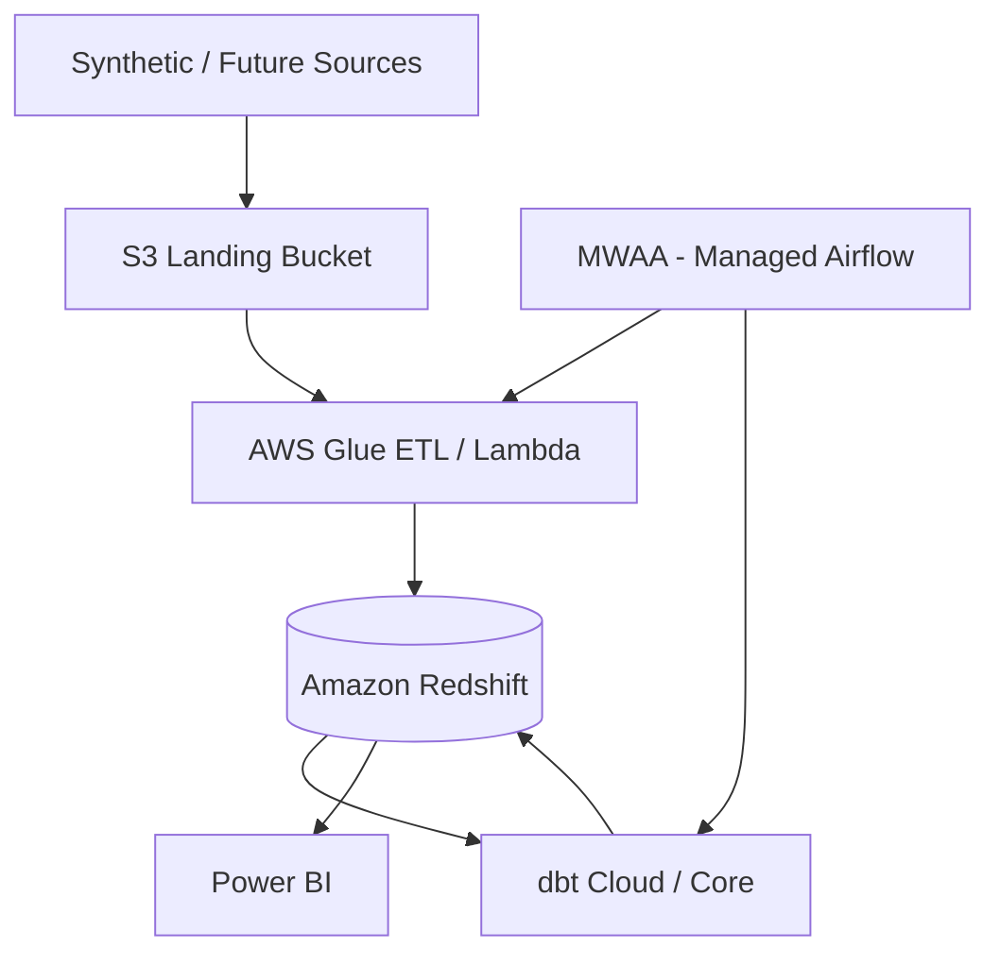
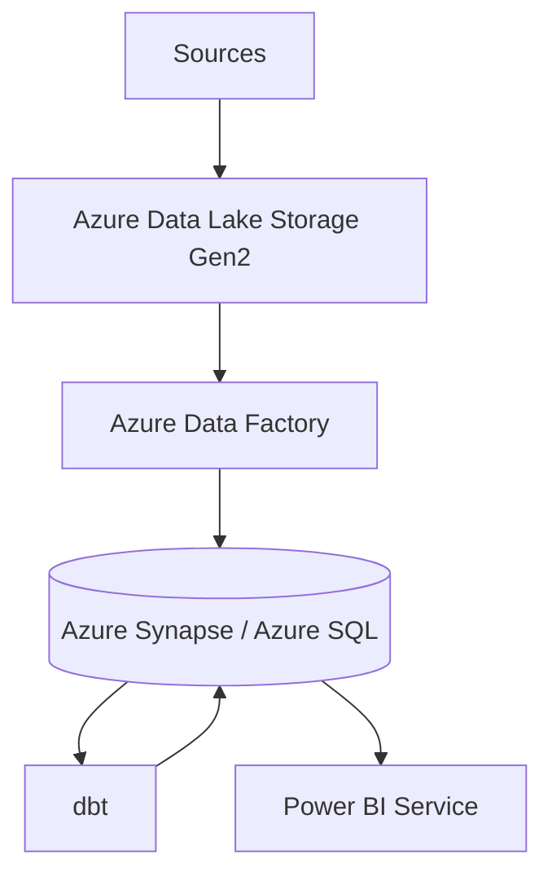
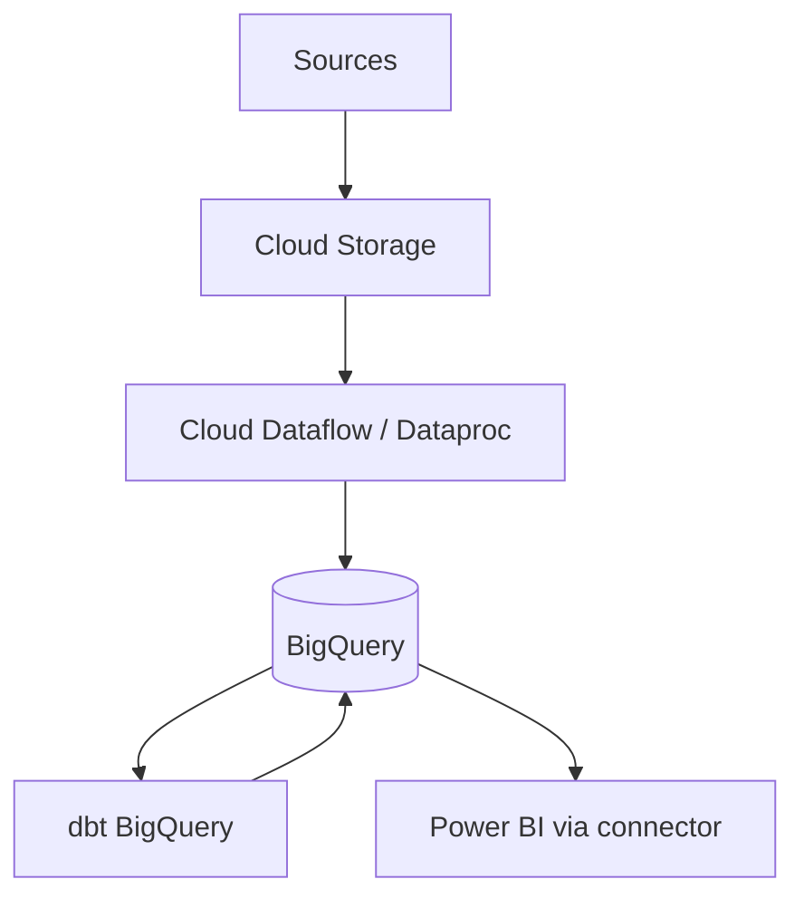

# NovaBank Cloud Architecture

> **Disclaimer:** This project uses synthetic banking data generated solely for demonstrating data engineering, analytics, and transaction-monitoring capabilities. It does not represent real customer or banking data.

This document describes **migration paths** from the local Docker/PostgreSQL stack to cloud platforms. No paid cloud resources are required to run the portfolio locally.

---

## Current State (Local)

```text
Python generator → CSV → PostgreSQL 16 → dbt → Python anomaly → Power BI
                              ↑
                    Airflow (Docker Compose)
```

---

## AWS Migration



| Component | Local | AWS Target |
|-----------|-------|------------|
| Landing zone | data/source/ | S3 `s3://novabank-raw/` |
| Ingestion | Python pandas | Glue jobs or Lambda |
| Warehouse | PostgreSQL | Redshift Serverless |
| Transform | dbt Postgres | dbt Redshift adapter |
| Orchestration | Airflow Docker | Amazon MWAA |
| Secrets | .env | AWS Secrets Manager |
| Anomaly ML | scikit-learn local | SageMaker batch transform or EMR |

**Networking:** VPC private subnets for Redshift; IAM roles for Glue→S3→Redshift COPY.

**Cost control:** Redshift Serverless auto-pause; S3 lifecycle to Glacier for old extracts.

---

## Azure Migration



| Component | Azure Service |
|-----------|---------------|
| Storage | ADLS Gen2 hierarchical namespace |
| Orchestration | Azure Data Factory pipelines |
| Warehouse | Synapse dedicated SQL pool or Azure SQL |
| BI | Power BI Premium / Pro (native Azure integration) |
| Airflow alternative | ADF scheduling or self-hosted AKS Airflow |
| Key Vault | Connection strings, service principals |

**Advantage:** Power BI and Azure are tightly integrated — DirectQuery to Synapse with Azure AD auth.

---

## GCP Migration



| Component | GCP Service |
|-----------|-------------|
| Storage | GCS buckets per environment |
| Processing | Dataflow (Apache Beam) for ingest |
| Warehouse | BigQuery (serverless, columnar) |
| Orchestration | Cloud Composer (managed Airflow) |
| ML | Vertex AI for anomaly models |
| IAM | Service accounts per pipeline stage |

**Advantage:** BigQuery separation of storage/compute; excellent for ad-hoc SQL analytics at scale.

---

## Cross-Cloud Design Principles

1. **Keep dbt as transform layer** — swap `profile` target only
2. **Immutable landing** — never overwrite raw extracts; partition by `ingest_date`
3. **Environment isolation** — dev/staging/prod databases or projects
4. **Secrets never in git** — use vault services
5. **Same grain definitions** — fact transaction event grain unchanged
6. **Incremental everywhere** — watermarks in cloud metadata table (equivalent to `audit.pipeline_watermarks`)

---

## Hybrid Path (Incremental Migration)

```text
Phase 1: Lift PostgreSQL to RDS / Cloud SQL (minimal change)
Phase 2: Move raw files to object storage
Phase 3: Introduce cloud ELT (dbt Cloud + warehouse)
Phase 4: MWAA/Composer replaces local Airflow
Phase 5: Power BI Service datasets with scheduled refresh
```

---

## Monitoring in Cloud

| Local | Cloud equivalent |
|-------|------------------|
| audit.pipeline_runs | CloudWatch / Azure Monitor / Cloud Logging |
| audit.data_quality_results | Great Expectations + S3 reports |
| monitoring.transaction_anomalies | Warehouse table + alerting (SNS, PagerDuty) |

---

## Security (Synthetic Data Still Matters)

Even with synthetic data, practice production patterns:

- Private endpoints for warehouse
- Encryption at rest (KMS, Azure Key Vault, CMEK)
- RBAC for BI workspaces
- No public S3/GCS buckets

---

## Cost Comparison (Qualitative)

| Platform | Best for |
|----------|----------|
| AWS | Glue+Redshift shops, MWAA maturity |
| Azure | Power BI-centric enterprises |
| GCP | BigQuery analytics, ML on Vertex |

Local Docker remains the **zero-cost** portfolio demo; cloud paths show interview readiness for migration discussions.
