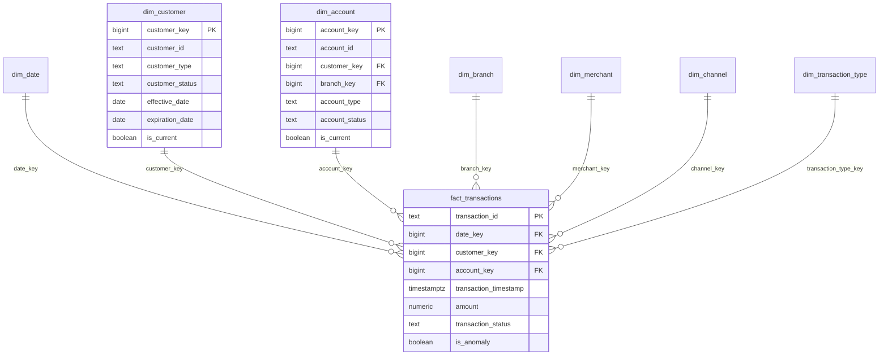

# NovaBank Data Model

> **Disclaimer:** This project uses synthetic banking data generated solely for demonstrating data engineering, analytics, and transaction-monitoring capabilities. It does not represent real customer or banking data.

## Modeling Approach

NovaBank uses a **Kimball-style star schema** in the `warehouse` schema, with business-facing **analytics marts** in the `analytics` schema. dbt manages lineage from `raw` through `staging` and `intermediate` layers.

---

## Fact Table Grain

> **One row in the central transaction fact represents one financial transaction event.**

This applies to `warehouse.fact_transactions`. Each row captures a single completed, pending, failed, or reversed banking event at the moment it occurred in the source system. Aggregations (daily totals, customer lifetime value) are derived by grouping fact rows — they are not stored at a different grain in the central fact.

Supporting facts at their own grains:

| Fact table | Grain |
|------------|-------|
| `fact_transactions` | One row per core banking transaction event |
| `fact_card_transactions` | One row per card authorization/capture event |
| `fact_atm_transactions` | One row per ATM session event |
| `fact_transfers` | One row per transfer instruction event |

---

## Star Schema Diagram



---

## Dimension Tables

### Type 1 (overwrite) dimensions

These attributes change rarely or historical tracking is not required:

- `dim_date` — calendar attributes (day, week, month, quarter, is_weekend)
- `dim_branch` — branch location and type
- `dim_merchant` — merchant category and region
- `dim_card` — card type and status (current snapshot)
- `dim_channel` — ATM, Branch, Mobile App, Internet Banking, POS, Online
- `dim_transaction_type` — Deposit, Withdrawal, Transfer, Payment, etc.

### SCD Type 2 dimensions

Customer and account attributes that affect historical analysis use **Slowly Changing Dimension Type 2**:

#### `dim_customer`

Tracks changes to `customer_type`, `customer_status`, and geography (`city`, `region`, `country`).

| Column | Purpose |
|--------|---------|
| `customer_key` | Surrogate PK (unique per version) |
| `customer_id` | Natural business key |
| `effective_date` | Version start |
| `expiration_date` | Version end (`9999-12-31` for current) |
| `is_current` | Boolean flag for current row |

When a customer's status changes from `Active` to `Suspended`, a new row is inserted with a new `customer_key`. Historical facts retain the `customer_key` valid at transaction time.

#### `dim_account`

Tracks `account_type`, `account_status`, `branch_key`, and `currency` changes similarly.

Implementation: dbt snapshot or merge logic in `dbt/models/warehouse/dimensions/dim_customer.sql` and `dim_account.sql`.

---

## Surrogate Keys

Natural keys (`customer_id`, `account_id`) come from source systems and may have data quality issues in `raw`. Surrogate integer keys (`customer_key`, `account_key`) provide:

- Stable joins even when natural keys are corrected
- Efficient indexing on fact tables
- SCD2 versioning without composite keys

Facts store surrogate keys only; natural IDs are available via dimension joins.

---

## Relationships

```text
dim_customer (1) ──< (M) dim_account
dim_customer (1) ──< (M) fact_transactions
dim_account    (1) ──< (M) fact_transactions
dim_branch     (1) ──< (M) fact_transactions  [nullable for digital channels]
dim_merchant   (1) ──< (M) fact_transactions  [nullable for non-merchant txns]
dim_channel    (1) ──< (M) fact_transactions
dim_date       (1) ──< (M) fact_transactions
```

Card and ATM facts additionally join `dim_card`.

---

## Analytics Marts (Denormalized)

Marts in `analytics` schema pre-aggregate for BI performance:

| Mart | Purpose |
|------|---------|
| `mart_daily_transactions` | Daily KPIs, rolling averages, MoM |
| `mart_monthly_transactions` | Monthly trends, YoY |
| `mart_customer_activity` | Per-customer metrics + activity segment |
| `mart_account_activity` | Inflows, outflows, net flow |
| `mart_branch_performance` | Branch rankings |
| `mart_channel_performance` | Channel comparison |
| `mart_payment_activity` | Payment type breakdown |
| `mart_anomaly_monitoring` | Anomaly-enriched transaction view |
| `mart_transaction_failures` | Failure analysis |

Power BI connects primarily to `analytics` marts; ad-hoc SQL may join `warehouse` directly.

---

## Date Dimension

`dim_date` spans `DATA_START_DATE` to `DATA_END_DATE` from configuration (default 2023-01-01 through 2025-12-31). Keys are integer `YYYYMMDD` format for efficient joins.

---

## Design Decisions

1. **Raw TEXT columns** — preserve source imperfections for realistic DQ demos
2. **Clean in staging** — single place for type casting and status maps
3. **Business logic in intermediate** — reusable metrics for multiple marts
4. **Incremental facts** — `updated_at` watermark for large-scale reruns
5. **Separate monitoring schema** — anomaly results isolated from warehouse SCD logic

See [data_dictionary.md](data_dictionary.md) for column-level detail and [metrics.md](metrics.md) for derived KPI definitions.
